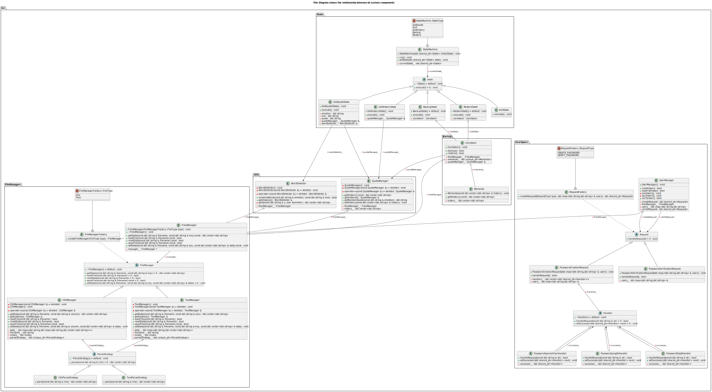

# Random Quote generator 
This is a simple random quote generator that generates a random quote from a list of quotes, based on the user's input.
program will predict the user's mood based on the happyor sad words in the input and generate a quote accordingly (dummy prediction).

User will be asked to create a user at the first run of the program. The user will be saved in a CSV file with hashed password (SHA224),
with chain of responsibility pattern, the program will check for prequisites in password creation (length, digits, special characters) and will hash the password before saving it to the file.

## Used Design Patterns
- Singleton
- Factory / Abstract Factory
- Strategy
- State Machine
- Chain of Responsibility
- Facade
- Memento

## How to run the program
I've created a wrapper makefile of cmake commands to make it easier to run the program.
Commands:
- `make build` : to build the program using cmake
- `make run` : to run the program
- `make clean` : to clean the build files
- `make doc` : to generate documentation using doxygen and UML diagrams using `clang-uml` tool

## Used Libraries
- [Doxygen](https://www.doxygen.nl/index.html) : to generate documentation
- [clang-uml](https://clang-uml.github.io/index.html) : to generate UML diagrams
- [CMake](https://cmake.org/) : to build the program

## UML Diagram

Diagrams for each system component can be found in the `docs/diagrams` folder

## TODO
- Create Logger library to log the program's output either to a file or to the console 
- Unit testing using [Google-Test](https://github.com/google/googletest)

